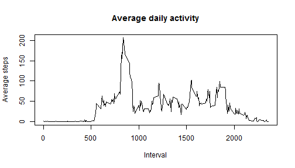

---
output:
  html_document:
    keep_md: yes
---
# Reproducible Research: Peer Assessment 1
Janne Simonen  

This document is a project for the Coursera online course *Reproducible Research*.
The assignment makes use of data from a personal activity monitoring device. 
This device collects data at 5 minute intervals through out the day. The data 
consists of two months of data from an anonymous individual collected during the 
months of October and November, 2012 and include the number of steps taken in 
5 minute intervals each day.

The data has the following variables  

- steps: Number of steps taking in a 5-minute interval (missing values are coded as NA)  
- date: The date on which the measurement was taken in YYYY-MM-DD format  
- interval: Identifier for the 5-minute interval in which measurement was taken.  

## Loading and preprocessing the data

The activity monitoring data is provided as a zipped CSV file, so we first unzip
it and then read it into a table. For the analysis, we also need to convert the date 
strings into date format. The following code takes care of all of that.


```r
unzip("activity.zip")
activity <- read.csv("activity.csv",stringsAsFactors=FALSE,na.strings="NA")
activity$date <- as.Date(activity$date, "%Y-%m-%d")
```

## Total number of steps taken per day

Let's calculate the number of steps taken per day. We ignore the missing values.


```r
library(plyr) 
stepsperday <- ddply(activity, .(date),summarize,steps = sum(steps, na.rm=TRUE))
meansteps <- mean(stepsperday$steps)
mediansteps <- median(stepsperday$steps)
```

The mean steps per day is 9354 and median 1.0395 &times; 10<sup>4</sup>. 
Let's plot a histogram.


```r
hist(stepsperday$steps,breaks=20,xlab="Steps per day",main="Histogram of steps per day")
```

 

## What is the average daily activity pattern?

Let us study the daily activity pattern by averaging the number of steps for each 5 minute interval
across all day in the dataset.


```r
library(plyr) 
stepsperint <- ddply(activity, .(interval),summarize,averageSteps = mean(steps, na.rm=TRUE))
maxavesteps <- max(stepsperint$averageSteps)
maxavestepsIndex <- which.max(stepsperint$averageSteps)
maxinterval <- activity$interval[maxavestepsIndex]
```

The maximum number of steps, on average, is 206 
which happens in time interval 835. This can be seen from the following
time series plot


```r
with(stepsperint,plot(interval,averageSteps,type="l",xlab="Interval",
                      ylab="Average steps",main="Average daily activity"))
```

 


## Imputing missing values

Note that there are a number of days/intervals where there are missing values. The presence of missing days may introduce bias into some calculations or summaries of the data.  

Let's calculate the total number of missing values in the dataset (i.e. the total number of rows with NAs)


```r
# rows with NAs = total number of rows - number of rows without missing data
missingValues <- nrow(activity) - sum(complete.cases(activity))
```

Of the {r nrow(activity)} rows of data thera are **{r missingValues} rows with missing data**.  

To make the analysis a bit more accurate, we have to replace the missing values with a sensible value.
Let's use the mean number of steps for a given time interval as a replacement for all NAs recorder for that day.


```r
# calculate the mean number of steps for each interval
library(plyr) 
meanstepsperint <- ddply(activity, .(interval),summarize,meansteps = mean(steps, na.rm=TRUE))
# number of steps is an integer so let's round
meanstepsperint$meansteps <- round(meanstepsperint$meansteps)
# repeat the matrix to be the same size as the activity matrix, i.e. for all days
# the trick is from StackExchange
meanstepsfull <- do.call("rbind", rep(list(meanstepsperint), nrow(activity)/nrow(meanstepsperint)))
# replace the NAs in activity with the means for each interval
NAs <- !complete.cases(activity)
activity.NArep <- activity
activity.NArep$steps[NAs] <- meanstepsfull$meansteps[NAs]
```

Now that we have the data with NAs replaced, we can compare that with the original data.


```r
library(plyr) 
stepsperday.NArep <- ddply(activity.NArep, .(date),summarize,steps = sum(steps, na.rm=TRUE))
meansteps.NArep <- mean(stepsperday.NArep$steps)
mediansteps.NArep <- median(stepsperday.NArep$steps)
```

The mean steps per day for the data with NAs replace (values for original data in parenthesis) is 
1.0766 &times; 10<sup>4</sup> (9354) and median 
1.0762 &times; 10<sup>4</sup> (1.0395 &times; 10<sup>4</sup>).  

Let's plot a histogram.


```r
hist(stepsperday.NArep$steps,breaks=20,xlab="Steps per day",main="Histogram of steps per day, NAs replaced")
```

 

## Are there differences in activity patterns between weekdays and weekends?
